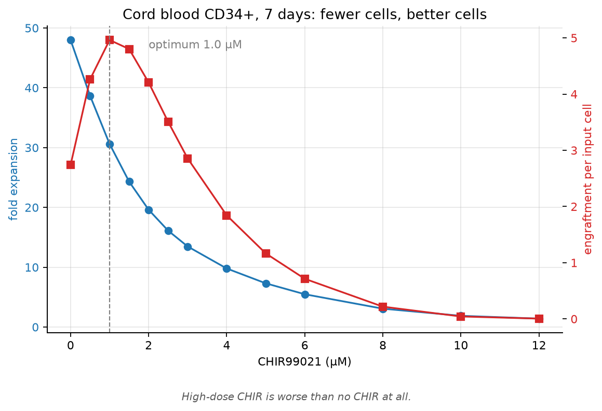
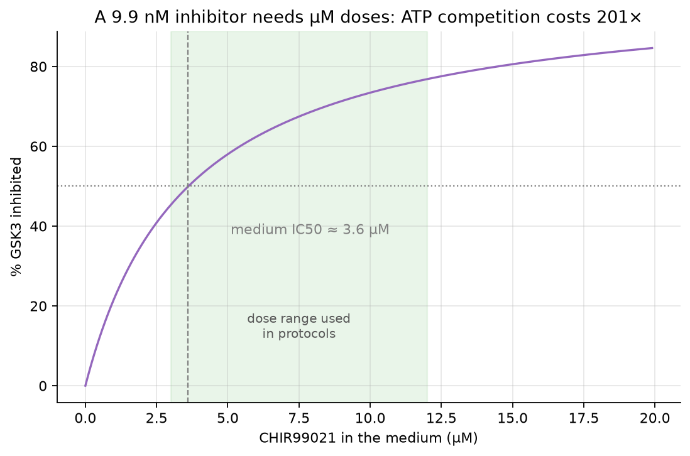
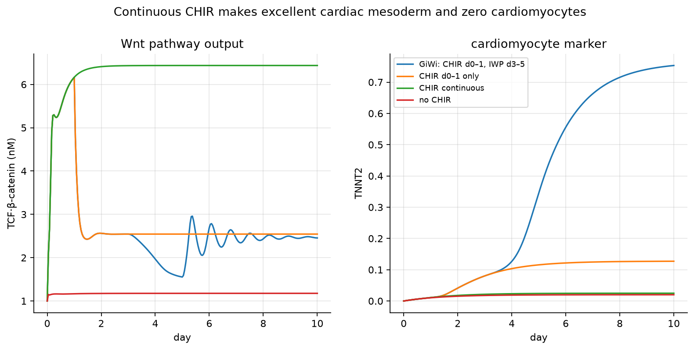
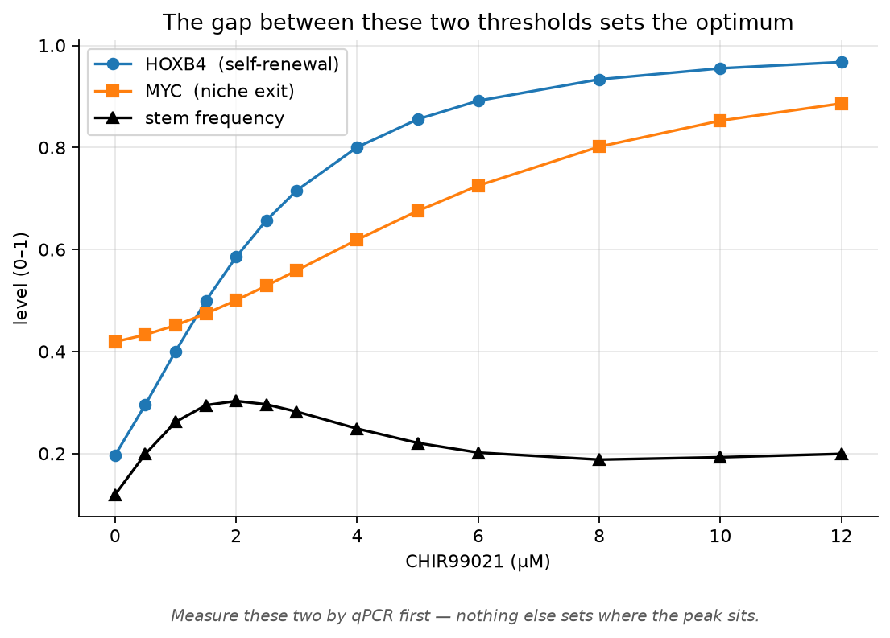
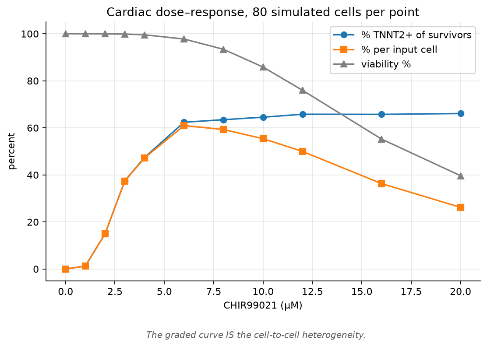

# Wnt dose-response

CHIR99021 to GSK3 to Wnt/beta-catenin to cell fate. A mechanistic model of how a
small molecule at the top of a signalling cascade ends up selecting a cell fate.
Runs in Node with no dependencies.

[](LICENSE)
[](https://nodejs.org)
[](https://www.python.org)


<p align="center">
  
</p>

Cord blood CD34+ over 7 days. Expansion falls across the whole range while
engraftment peaks at 1 µM. Past the MYC threshold you get neither, so a high
dose ends up worse than no CHIR at all.

```bash
npm install      # nothing to install, but it sets up the scripts
npm run fast     # calibration, GSK3 curve, biphasic test, cord blood, inhibitors  (~1 min)
npm run all      # adds the population dose-response, lineage map and sensitivity  (~8 min)
npm run jupyter  # notebook, plots, and your own data alongside the model
```

Two fate modules share one signalling core:

| module | file | what it is for |
|---|---|---|
| Cardiac mesoderm | `src/model.js` | hPSC to cardiomyocyte, the CHIR/GiWi protocol |
| Cord blood HSPC | `src/hsc.js` | CD34+ ex vivo culture, self-renewal vs engraftment |

---

## Cord blood: direction of effect

In cord blood HSPC, GSK3 inhibition acts on self-renewal and engraftment rather
than on differentiation. The model and the published work agree on this. From
PubMed:

- [Holmes 2008, *Stem Cells*](https://doi.org/10.1634/stemcells.2007-0600):
  GSK-3β inhibition in cord blood CD34+ raises β-catenin, c-myc and HoxB4.
  Expansion slows while stem cell activity is preserved, and CXCR4 and stromal
  adherence both go up.
- [Ko 2011, *Stem Cells*](https://doi.org/10.1002/stem.551): cycle time
  lengthens, p57 rises, cyclin D1 falls, and engraftment improves per
  repopulating unit rather than by unit number.
- [Luis 2011, *Cell Stem Cell*](https://doi.org/10.1016/j.stem.2011.07.017):
  canonical Wnt regulates haematopoiesis in a dosage-dependent way. Five graded
  Apc alleles give lineage-specific optima, which is why gain-of-function studies
  report either HSC expansion or HSC depletion depending on how hard they pushed.
- [Shen 2014, *Stem Cells Dev*](https://doi.org/10.1089/scd.2014.0230): the same
  inhibitor given in vivo after transplant impairs regeneration and causes
  lasting T-cell depletion.

So pushing CHIR harder to force differentiation is the wrong direction for this
cell type. Run `npm run cordblood` to watch the model reproduce it.

A regulatory note, since it motivated the choice of cell type. Cord blood units
and the expanded product omidubicel are FDA-approved, but that approval does not
extend to CHIR99021, which is a research compound with no approved human use.
GSK3 inhibitors for HSPC are still preclinical.

---

## The four layers

```
  CHIR99021 (medium, µM)
        │  uptake, Kp
        ▼
  GSK3α/β activity          Ki_app = Ki·(1 + [ATP]/Km_ATP)   ← ATP-competitive
        │
        ▼
  destruction complex   ◄── AXIN2 (negative feedback, a Wnt target gene)
  Axin·APC·GSK3·CK1α    ◄── Fzd/LRP6 ◄── WNT3A / autocrine WNT ⊣ IWP2
        │               ◄── Axin stabilised by IWR-1 (tankyrase)
        ▼
  β-catenin:  cytoplasmic ⇄ nuclear ⇄ TCF/LEF     ⇄ cadherin pool
        │                      ▲
        │                      └── ARM-groove competition: TCF vs ICAT vs APC
        ▼                          BCL9/Pygo binds ARM1, required, not competing
  TCF·β-catenin  ── the pathway output
        │
        ├──► CARDIAC:  TBXT → MIXL1 → MESP1 → GATA4 → NKX2-5 → TNNT2
        │              EOMES → SOX17 (needs Nodal)
        │              ⊣ SOX2/NANOG/OCT4 ;  TCF·β-cat ⊣ NKX2-5
        │
        └──► HSPC:     HOXB4 (low threshold)  → self-renewal
                       MYC   (high threshold) → niche exit, differentiation
                       p57 ↑, cyclin D1 ↓, CXCR4 ↑
```

### Layer 0: why 6 µM and not 6 nM

CHIR99021 is ATP-competitive, with a biochemical Ki around 10 nM. Cells hold 1 to
5 mM ATP and GSK3β has a 15 µM Km for it, so Cheng-Prusoff gives

```
Ki_app = Ki · (1 + [ATP]/Km_ATP) = 9.9 nM · (1 + 3000/15) ≈ 2.0 µM
```

a 201-fold shift, or about 3.6 µM once you divide by the cell:medium partition
coefficient. That accounts for the dose every protocol uses, out of measured
numbers, with nothing fitted.

<p align="center">
  
</p>

It also predicts that anything moving the cellular ATP pool moves the effective
dose. Across 1 to 5 mM the medium IC50 slides from 1.2 to 6.0 µM, so galactose
medium, hypoxia, oligomycin and plating density should all shift the curve. That
is one candidate explanation for batch-to-batch variability, and it is testable
in a day.

### Layer 1: beta-catenin

Lee et al. 2003 architecture. Axin is the limiting scaffold, the destruction
complex phosphorylates β-catenin with Michaelis-Menten kinetics, and AXIN2 is
itself a Wnt target, which closes a strong negative feedback loop. Three things
sit on top of that.

Nuclear retention. APC and Axin shuttle β-catenin out of the nucleus, so
inhibiting the complex both spares β-catenin and holds it where it acts. Two
gains in series, which is why the TCF response is steeper than total β-catenin.

The cadherin sink. In hPSC most β-catenin sits at the junctions, and EMT at the
primitive streak releases it. That is fate feeding back onto signalling.

Explicit scaffold assembly, in `src/interfaces.js`, so that a tankyrase inhibitor
and a porcupine inhibitor come out as different perturbations instead of the same
knob under two names.

### Layer 2: fate

Every transcription factor obeys `dX/dt = k·drive - d·X` with `k == d`, so each
one is bounded on [0,1] and reads as a fraction of maximal expression.

Load-bearing wiring on the cardiac side:

| Wiring | Why |
|---|---|
| `TCF·β-cat → TBXT`, gated by SOX2 | the pluripotency-exit switch |
| SOX2 raises TBXT's threshold, does not veto it | a hard veto leaves the switch unflippable |
| `S(Activin) AND TCF·β-cat → EOMES → SOX17` | the mesoderm/endoderm fork |
| `TCF·β-cat ⊣ NKX2-5` | forces the protocol to be biphasic |
| GATA4 self-activation | carries cardiac identity across the Wnt-off gap |
| SOX17/FOXA2 self-activation | the same job on the endoderm side |
| NKX2-5 self-activation | commitment; returning Wnt no longer reverses it |

Both lineages need a latch to survive the CHIR washout. Remove GATA4's
self-activation and no schedule produces cardiomyocytes. Remove SOX17's and
endoderm peaks on day 1, then collapses when the 24 h spike ends. The symmetry
is itself a prediction: the commitment step in each arm should be a
self-reinforcing transcriptional loop rather than a downstream response to Wnt.

On the HSPC side, the non-monotonic dose-response is not asserted anywhere. It
emerges because two direct Wnt targets have different thresholds, with HOXB4
(self-renewal) switching on below MYC (niche exit). Mild activation raises
self-renewal and strong activation overruns it.

### Layer 3: the dish

The TBXT and GATA4 switches are bistable, so one deterministic cell gives an
all-or-none answer while flow cytometry reports a percentage. `population.js`
runs an ensemble with log-normal spread in drug uptake, destruction-complex
capacity, β-catenin synthesis, local paracrine density and streak competence.
The graded curve you measure at the bench is that heterogeneity.

---

## Results

### The biphasic Wnt requirement (`npm run biphasic`)

Nothing was fitted to this. It follows from one repression term plus two latches.

| arm | peak TBXT | GATA4 d10 | NKX2-5 d10 | TNNT2 d10 |
|---|---|---|---|---|
| no CHIR | 0.05 | 0.03 | 0.02 | 0.02 |
| CHIR 6 µM d0-d1 only | 0.91 | 0.95 | 0.11 | 0.13 |
| CHIR 6 µM continuous | 0.96 | 0.98 | 0.02 | 0.02 |
| GiWi (CHIR d0-1, IWP d3-5) | 0.91 | 0.87 | 0.72 | 0.75 |
| IWP d3-5 only | 0.05 | 0.03 | 0.02 | 0.02 |

Continuous CHIR makes perfectly good cardiac mesoderm and no cardiomyocytes.

<p align="center">
  
</p>

### Cord blood: the optimum is interior and low (`npm run cordblood`)

<p align="center">
  
</p>

The non-monotonic response is not built in. It emerges because HOXB4
(self-renewal) switches on below MYC (niche exit), so the gap between those two
thresholds sets where the optimum sits. That gap is also the measurement worth
making first.

7-day CD34+ culture with SCF/TPO/FLT3L:

| CHIR | fold expansion | stem frequency | engraftment |
|---|---|---|---|
| 0 µM | 48.0x | 0.119 | 2.74 |
| 1 µM | 30.6x | 0.262 | 4.96  (1.81x control) |
| 6 µM | 5.5x | 0.202 | 0.71 |
| 12 µM | 1.4x | 0.199 | ~0 |

Fewer cells, better cells, and past the MYC threshold neither, so a high dose is
worse than leaving the CHIR out. Lymphoid output falls steadily with dose, and
there is no lymphoid-friendly window anywhere on the curve.

### Bell-shaped cardiac dose-response (`npm run dose`)

<p align="center">
  
</p>

The rising limb is differentiation efficiency and the falling limb is viability.
Optimum 6 µM at 64.4 % yield, with the window above half-maximum running from
3 to 16 µM. The top is fairly flat, since 8 µM still gives 61.9 %. Scaling the
cell-to-cell CV trades peak yield against window width, so a tighter clone peaks
higher but has a narrower usable dose range.

One known limitation. About 28 % of cells are still TBXT+ at day 10 at every dose
above 3 µM. Those are the cells with the highest drawn autocrine Wnt tone, which
never get a Wnt-low window and so never commit or shut the streak programme off.
It reads as a prediction, that the non-cardiomyocyte fraction should be TBXT+
residual mesoderm concentrated where local Wnt was highest, but the number is
higher than a real day-10 culture and is probably a defect in the model.

### Wnt and Nodal are separate knobs (`npm run lineage`)

Scored at 26 h, where TBXT and MESP1 peak, and at day 7 for SOX17, across
CHIR by Activin:

| | Activin 0.18 (autocrine floor) | Activin 1.0 (100 ng/mL) |
|---|---|---|
| CHIR 0 | nothing leaves pluripotency | 79 % SOX17+ |
| CHIR 9 | 98 % TBXT+, 97 % MESP1+ | 100 % SOX17+, MESP1 ~0 |

Wnt sets whether cells leave pluripotency at all. Nodal sets which side of the
streak they leave through. Neither knob alone picks a lineage, because EOMES is
an AND-gate on both.

Two cautions, which apply to bench readouts as much as to the model. MESP1 is
transient: it peaks at 24 to 26 h, is down to about 0.3 by 48 h, and is gone by
day 3, so scored at day 7 it reads as background at every dose and makes the
cardiac arm look broken. And GATA4 does not separate these lineages, because
GATA4/GATA6 are definitive endoderm factors as well as cardiac mesoderm ones and
go high in both corners here. MESP1 is the cardiac-specific call.

Every panel reports mean level next to percent positive. MESP1 peaks at about
0.57 against a 0.5 gate, so the percentage swings on small parameter changes
while the mean does not, and reporting only the percentage would let a gating
artefact read as a biological effect.

### What the interface layer does and does not predict (`npm run inhibitors`)

With CHIR withdrawn, IWP2 and IWR-1 give the same fate. With CHIR held on there
is a narrow rescue window at 1.5 to 1.8 µM where IWR-1 recovers cardiomyocytes
(TNNT2 0.75) and IWP2 does not (0.03). Only IWR-1 acts below the step CHIR acts
on, so only it can claw back destruction-complex activity while the kinase is
inhibited. Above about 1.9 µM a 2.35x scaffold increase can no longer outrun the
inhibitor, and below about 1.5 µM the streak never fires at all.

That window is roughly 0.3 µM wide, which makes it both a sharp test and a
fragile prediction. It rests on `[F]`-tagged parameters, and a coarse dose grid
steps straight over it, which is why the scan runs at 0.1 µM resolution.

There is a second prediction that does not depend on finding that window at all.
IWR-1 drives the Wnt drop about twice as deep as IWP2 during washout, TCF_B 0.82
against 1.55, because it suppresses below the basal set point instead of only
removing ligand. That one is cheap to test: run GiWi with each inhibitor and read
AXIN2 by qPCR at d4.

ICAT titration shows the other half. ICAT and TCF are mutually exclusive on ARM
3 to 9, so ICAT drops the output by about 60 % without changing β-catenin levels,
which means a western blot would look unchanged while the reporter falls.

---

## Calibration

```bash
npm run fitcheck     # recovers known parameters from synthetic data first
```

See [data/README.md](data/README.md) for the CSV format, and for which parameters
to fit against which assay. Fitting everything against everything gives a good
SSE and meaningless parameters.

`fit()` bounds each parameter within a multiplicative factor of its current value
and flags any that finish sitting on a bound. A flagged parameter means your data
does not constrain it, not that it fitted to an extreme.

## Parameter provenance

Every parameter in `src/params.js` is tagged `[M]` measured, `[D]` derived, `[F]`
fitted to a published qualitative result, or `[A]` assumed. `npm run sens` ranks
all of them by normalised sensitivity, so you can see which guesses matter before
spending bench time on any of them.

The two thresholds worth measuring first are `hsc.K_w_hoxb4` and `hsc.K_w_myc`.
Their separation is what makes the cord blood dose-response non-monotonic, and
nothing else in the model sets where the optimum sits.

Two results from `npm run sens` change how you should approach calibration.

66 of 112 parameters move neither endpoint by more than 2 % per 10 % change, so
leave those at their assumed values. Almost everything at the top of the ranking
belongs to the Wnt module.

The four CHIR pharmacology parameters are structurally unidentifiable
individually, and a fate readout cannot see them at all:

| parameter | S[TNNT2 d10] | S[peak TCF_B] |
|---|---|---|
| `chir.Ki_gsk3b` | 0.00 | -0.44 |
| `chir.ATP_cell` | 0.00 | -0.44 |
| `chir.Kp` | 0.00 | +0.44 |
| `chir.Km_ATP` | 0.00 | +0.43 |

They only ever appear as the combination `Ki·(1 + ATP/Km)/Kp`, so the equal and
opposite sensitivities are exact. Only the apparent IC50 is identifiable, and
fitting them separately returns whatever the optimiser happened to wander into.
The zeros matter too. At 6 µM the system is saturated past the switch, so TNNT2
tells you nothing about CHIR potency. Use TOPflash, or a fate readout near the
threshold dose of 2 to 3 µM, where the switch still responds.

## Scope and limitations

The model is not spatial. Colony density and edge effects drive much of the
patchiness in real differentiation, and every cell here sees the same medium.

It is not structural. The interface layer is binding thermodynamics, not atomic
detail, and says nothing about how CHIR sits in the GSK3β ATP pocket.

It is not niche-aware. The HSPC module has no stroma and no adhesion, and CXCR4
is a number rather than a marrow.

And it is not fitted to your data. The `[F]` values reproduce published
qualitative behaviour, so quantitative prediction for your line needs your
numbers.

## Layout

```
src/params.js      every parameter, tagged by provenance
src/wnt-core.js    layers 0-1, shared by both fate modules
src/interfaces.js  destruction-complex assembly + ARM-groove competition
src/model.js       cardiac mesoderm fate layer
src/hsc.js         cord blood HSPC fate layer
src/population.js  heterogeneous ensemble -> flow-cytometry-like readouts
src/fit.js         Nelder-Mead calibration against measured data
src/kinetics.js    Hill / Michaelis-Menten / noisy-OR helpers
src/integrate.js   RK4, step verified by halving, throws on non-finite states
src/protocol.js    medium schedules (GiWi, endoderm, cord blood)
experiments/       runnable studies, each writes CSV to out/
data/              where measurements go
docs/figures/      the plots rendered in this README
run.js             CLI, both models:
                     node run.js --chir 6 --chir-end 24 --days 10
                     node run.js --model hsc --chir 1 --chir-end 168 --days 7
```

## Using it from Jupyter

```bash
npm run jupyter              # or double-click start-jupyter.cmd
```

Use that rather than a bare `python -m jupyterlab`. Jupyter roots its file
browser at the shell's current directory, so launching it from another project
serves that project instead and looks like Jupyter opening the wrong thing.
`start-jupyter.cmd` pins the root to this repo through its own location, so it
lands in the right place wherever you run it from, including a double-click.

`notebooks/stemcell.py` wraps the model for Python. The model stays in
JavaScript and the wrapper only starts it and parses the output, so there is one
implementation of the biology and no second copy to keep in sync.

```python
import stemcell as sc

df = sc.run(model="hsc", chir=1, chir_end=168, days=7)   # trajectory -> DataFrame
s  = sc.population(model="cardiac", chir=6, cells=200)   # flow-like percentages
sw = sc.sweep([0, 1, 2, 4, 6, 12], model="hsc", days=7, chir_end=168)
txt = sc.experiment("07_iwr_vs_iwp")                     # any experiment's output
```

`run.js --json` is what makes that work. It emits the trajectory, the protocol
and, for the HSPC model, the engraftment read-outs as JSON on stdout, so nothing
has to scrape formatted tables.

`notebooks/01_explore.ipynb` is a starter notebook covering the cord blood dose
curve, the HOXB4/MYC threshold gap behind it, the cardiac biphasic comparison and
the population readout.
